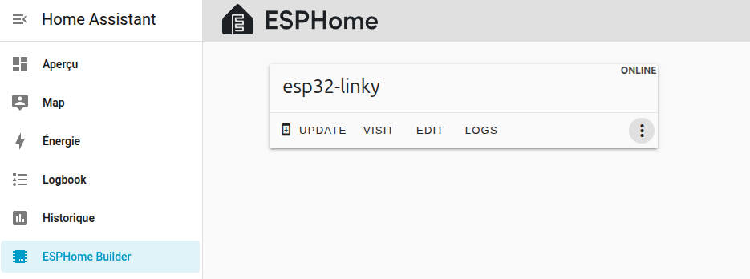

# Home-Assistant-Linky-Teleinfomation
 Linky Téléinformation pour Home Assistant avec ESPHOME

 ----------------------------------------------------------------------------------------------------------------
 Le Raspberry 3B est très juste pour pouvoir compiler et flasher le module ESP32 mais je n'avais que ça sous la main
 La compilation (installation) prend environ 40 minutes mais c'est possible
 ----------------------------------------------------------------------------------------------------------------

 Pour pouvoir ajouter simplement des modules complémentaires, prennez image contenant:
 - HA Operating System
 - Home Assitant
 - Supervisor
 
# Environnement matériel (configuration minimale)
- Boitier X820-C6 : Metal Case Kit
- Raspberry 3B
- X820 V3.0 2.5" SATA HDD/SSD Shield
- Disque SSD 120GB 
- Une carte SD 32 giga
- Un adaptateur SD USB
- Un écran HDMI à connecter sur la Raspberry 3B
- Un clavier USB à connecter sur la Rasberry 3B
- Un cable réseau pour connecter la Rasberry 3B sur votre réseau local

# Environnement logiciel de test
- Raspberry OS Lite 64 bits
- Home Assitant  V16.2 : haos_rpi3-64-16.2.img.xz
  - https://github.com/home-assistant/operating-system/releases/download/16.2/haos_rpi3-64-16.2.img.xz

# Outils nécessaires
- Ordinateur personnel connecté sur votre réseau local
  - Pour graver l'image haos_rpi3-64-16.2.img.xz sur le SSD
  - Pour accéder à l'interface Web de Home Assistant
  - Pour accéder à l'interface web de votre module ESPHOME
  - Test fait avec Linux Mint V22
- Interface SATA USB pour connecter le SSD sur l'ordinateur
- Logiciel pour transférer l'image : Balena Etcher

# Matériel 1 : ESP32 dev kit
- Vous pouvez utiliser un autre modèle mais il faudra changer la déclaration esp32-linky.yaml
  - esp32:
    - board: xxxx
- Type WROOM 32 avec 4 Mo de flash (30 broches)
 

# Matériel 2 : Linky Interface

Attention, les BS170 que j'ai reçu avait un brochage inversé S-G-D (au lieu de D-G-S) ça ne fonctionnait pas !!!
- C'est reconnaissable, la tension entre Drain et Source était de 0,6V alors que la grille était à zéro.

Pour un linky en mode <b>standard</b>, il faut peut être passer la valeur de la résistance <B>R1 à 1k</b>.

ESP (ESP8266 or ESP32) Input specifications (Entrée Teleinfo):
- Niveau bas : Tension inférieure à Vil (max) = 0.25 * 3.3 = 0.825V
- Niveau Haut : Tension supérieure à Vih (min) = 0.75 * 3.3 = 2.475V

Test de l'interface:
- La LED TIC doit être éteinte (Tension en Drain et Source environ 3.3 Volts)
- En reliant l'entrée 1 à GND et 2 à 3.3V la LED TIC doit s'allumer (Tension en Drain et Source environ 0 Volt)
- Avec une tension variant entre 0V et 3.3V on respecte bien les spécifications ESP

Connexions au compteur Linky (il n'y a pas de sens, on peut inverser)
- Connecter Teleinfo 1 et sur I1 du compteur
- Connecter Teleinfo 2 et sur I2 du compteur

Connexions à Serial2 de ESP32 WROOM
- GND : GND de ESP (GND) 
- +V  : 3V  de ESP (3.3V)
- RXD : Entrée Teleinfo de l'ESP (esp32-linky.yaml uart_pin: GPIO16)

# Matériel 3 : Interface pour flasher haos_rpi3-64-16.2.img.xz sur le disque SSD
- Titre : Adaptateur mSATA vers SATA clé B m.2 SATA SSD vers SATA carte adaptateur mSATA m.2 NGFF vers USB convertisseur pour mSATA + M.2 2 en 1 SSD HDD Riser
- Il permet de connecter différents modèle de mémoire flash en USB
- Mais surtout le câble permet de connecter en USB un disque SATA (normal ou SSD) 

- Disque SSD

- Si vous n'avez pas de carte d'interface SSD X820, vous pouvez connecter sur la Raspberry 3B le disque SSD avec ce câble, cela fonctionnera
- On peut même utiliser un petit disque SATA de 80 Giga normal (pas SSD) cela fonctionnera aussi

# Etape 1 : Installation de Home Assistant V16.2
- 1 Positionner le flag boot from USB de la Raspberry 3B
- 2 Graver l'image de haos sur le disque SSD
- 3 Retirer la carte SD de la Raspberry 3B
- 4 Connecter le disque SSD sur la Raspberry 3B
- 5 Mettez sous tension : ça boote directement sur haos
  - Les logs de boot s'affichent sur l'écran connecté à la Raspberry 

# Etape 2 : Configurer Home Assistant
- Depuis http://homeassistant.local:8123

Ajout des modules complémentaires

Augmentation du swap space (A ajouter uniquement si le serveur Home Assistant est une Raspberry 3B)

Ajout de l'éditeur de fichier

Ajout de ESPHome builder

# Etape 3 : Création du module
- Cliquer en bas à droite sur <b>+ NEW DEVICE</b>
- Donnez lui le nom esp32-linky : cela crééra le fichier esp32-linky.yaml
- Choisissez comme type ESP32
- Affichage de configuration created
- Cliquez sur <b><SKIP</b>

# Etape 4 : Export api key and ota passord dans secrets.yaml

- Editer le fichier de configuration de votre module esp32-linky

- Ajouter ou mettre à jour les secrets

# Etape 5 : Test d'installation de ce module qui ne fait rien

- Validate : Valider la configuration : Elle doit être valide
- Install : Installer la configuration
- Choisir Plug into the computer running ESPHome Builder
- Choisir le port : Dans mon cas CP2102 USB to UART Bridge Controler (/dev/ttyUSB0)
- Là vous pouvez aller prendre plusieurs cafés ... (c'est très long)

# Etape 6 : ESPHome : Installer les fichiers 

## Organiser les fichiers de configuration

- Utiliser l'éditeur de fichier pour créer, modifier ou importer les fichiers de configuration
  - Les fichiers de configuration sont dans le dossier esphome de ce projet github

- Le dossier de configuration de ESPHome contient:

- Un fichier de configuration secrets.yaml qui contient différents users et mots de passes
  - Ceci afin qu'ils ne soit pas dans vos fichiers de chaque module ESP (sécurité)

- Un fichier de config pour chaque module ESPHome créé : esp32-linky.yaml (créé lors de l'étape suivante)

## Création du sous-dossiers linky (<ESPHOME>/common/linky)

- Un dossier common (à créer)
- Dans le dossier <b>common</b> créer dossier <b>linky</b> qui contient les fichiers yaml inclus pour chaque config linky
  - linky_TIC_historic_base_mono.yaml : linky en mode historique avec un abonnement de base monophasé
  - linky_TIC_historic_hphc_mono.yaml : linky en mode historique avec un abonnement heure pleine heure creuse monophasé
  - linky_TIC_standard_base_mono.yaml : linky en mode standard avec un abonnement de base monophasé

A vous de modifier le fichier esp32-linky.yaml afin d'inclure la bonne configuration pour votre compteur linky
Pas défaut c'est la configuration linky_TIC_historic_hphc_mono.yaml qui est incluse (voir section <b>packages:</b>)

# Etape 7 : Installation de la configuration Linky
- Sauvegarder le fichier esp32-linky.yaml (pour pouvoir faire un retour arrière et des comparaisons en cas de problème)
- Remplacer le fichier esp32-linky.yaml par celui de ce projet (esphome/esp32-linky.yaml)
- Créer le dossier common puis le dossier linky
- Importer les différentes configurations linky (vous pouvez mettre uniquement celle qui vous concerne)
- Vérifier et modifier si nécessaire esp32-linky.yaml pour inclure la bonne configuration 
  - Section packages:
  - La ligne utilisée ne commence pas par #
  - Les lignes commencant par # sont inutilées (considérées comme des commentaires)
 
# Etape 8 : Installer le code dans le module ESP32
- Connectez votre module ESP32 sur votre serveur Home Assistant (Raspberry 3B) avec un câble USB
- Cliquer sur le module
- Validate : Valider la configuration : Elle doit être validée
- Install : Installer la configuration
- Choisir Plug into the computer running ESPHome Builder
- Choisir le port : Dans mon cas CP2102 USB to UART Bridge Controler (/dev/ttyUSB0)
- Là vous pouvez aller prendre plusieurs cafés ... (c'est très très très long)

# Etape 9 : Tester votre module esp32-linky
- Dans le fichier esp32-linky.yaml, l'interface web est activée
  - Section <b>web_server:</b>
    - Port <b>port: 80</b>
- On peut donc accéder au module par son nom <b>http://esp32-linky.local</b> (<nom-du-mudule>.local)
- Ou en cliquant sur le bouton VISIT du module

- Cette action ouvre un nouvel onglet dans votre navigateur avec la page suivante:

Dans cet écran, le module n'est pas encore connecté au compteur linky !
